# OpenTenBase 单机开发环境配置
`
本文档为开发入门指南，以便初学者快速搭建 OpenTenBase 的开发环境。
`

## 环境准备

- 虚拟机: VirtualBox 7.0
- 分配内存: 最少 4 G 
- 分配磁盘: 最少 50 G
- 操作系统: CentOS-7-x86_64
- 开发工具: Eclipse IDE for C/C++ Developers 2023-12
- 终端工具: MobaXterm v23.2

## 安装软件包
``` bash
[root@localhost ~]# yum groupinstall "X Window System"
[root@localhost ~]# yum -y install gcc make readline-devel zlib-devel openssl-devel uuid-devel bison flex
[root@localhost ~]# yum -y install gdb git java-1.8.0-openjdk.x86_64 xclock
```


## 新建开发账号

``` bash
#开发账号
[root@localhost ~]# useradd opentenbase

#开发目录
[root@localhost ~]# mkdir -p /data/opentenbase

[root@localhost ~]# chown -R opentenbase.opentenbase /data/opentenbase

```

测试 X11 环境是否可用，使用 opentenbase 账号登录终端 (不是用 root 用户通过 su 命令切换)，执行 xclock 确认弹出小闹钟。
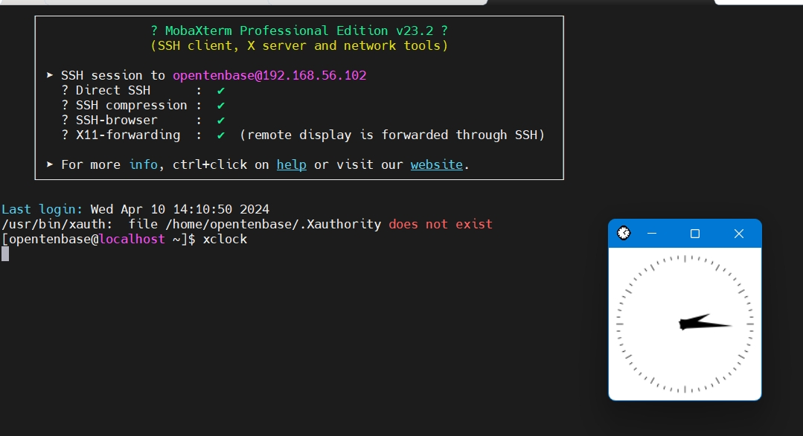


## 下载源码

建议把官方代码 fork 到自己的账号，然后 clone 自己仓库的代码，这样以后修改了可以直接向自己的库里提交。

``` bash
[opentenbase@localhost ~]$ cd /data/opentenbase
[opentenbase@localhost opentenbase]$ git clone https://github.com/yousoa/OpenTenBase.git --depth 0
```

## 部署 OpenTenBase 集群环境
参考 [单机部署文档：stand-alone-deployment.md](../stand-alone-deployment/stand-alone-deployment.md)

> 注： configure 命令需要加入 --enable-debug 编译后的程序支持调试。

``` bash
# configure 命令参数可以用如下形式

./configure --prefix=${INSTALL_PATH}/opentenbase_bin_v2.0 --enable-user-switch --with-openssl --with-ossp-uuid CFLAGS=-g --enable-depend --enable-cassert --enable-debug
```

## 下载Eclipse

```bash
[opentenbase@localhost opentenbase]$ curl -O https://mirrors.nju.edu.cn/eclipse//technology/epp/downloads/release/2023-12/R/eclipse-cpp-2023-12-R-linux-gtk-x86_64.tar.gz

[opentenbase@localhost opentenbase]$ tar xzvf eclipse-cpp-2023-12-R-linux-gtk-x86_64.tar.gz
```

## 运行 Eclipse , 导入工程

运行eclipse

```bash
[opentenbase@localhost eclipse]$ cd /data/opentenbase/eclipse
[opentenbase@localhost eclipse]$ ./eclipse
```

导入工程
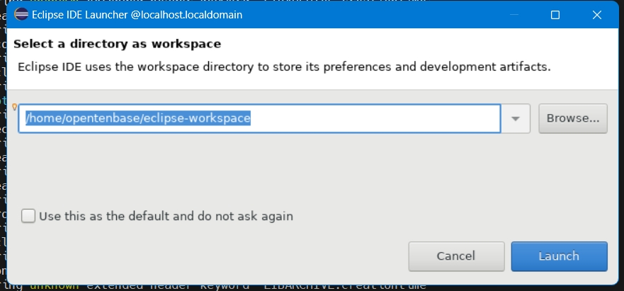
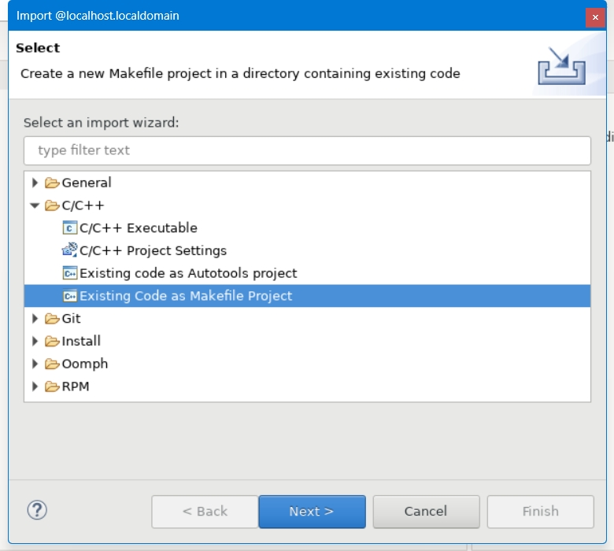
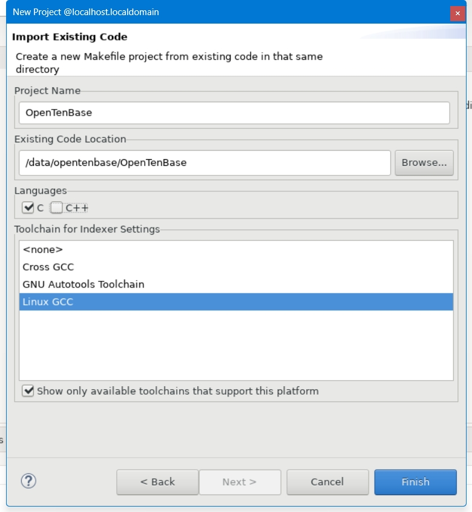

## 调试

### 查询进程 PID
登录数据库通过 pg_stat_activity 表查 pid，或通过 select pg_backend_pid(); 查询。
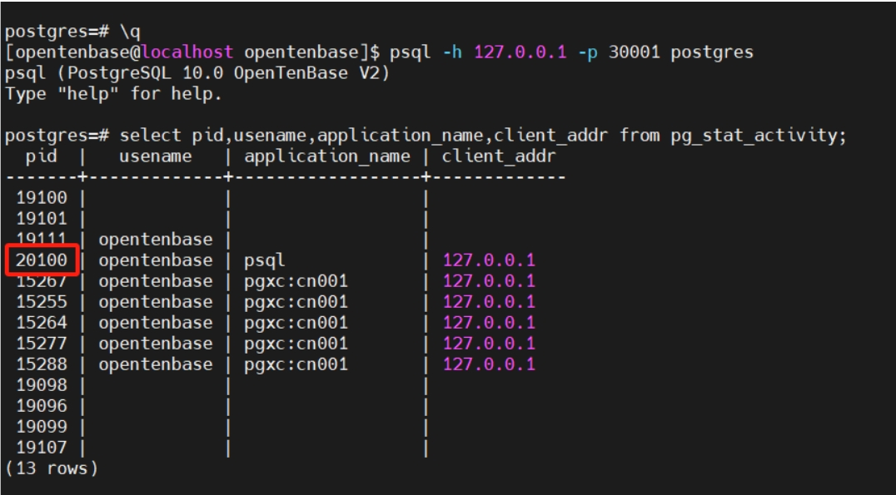


### 绑定调试进程
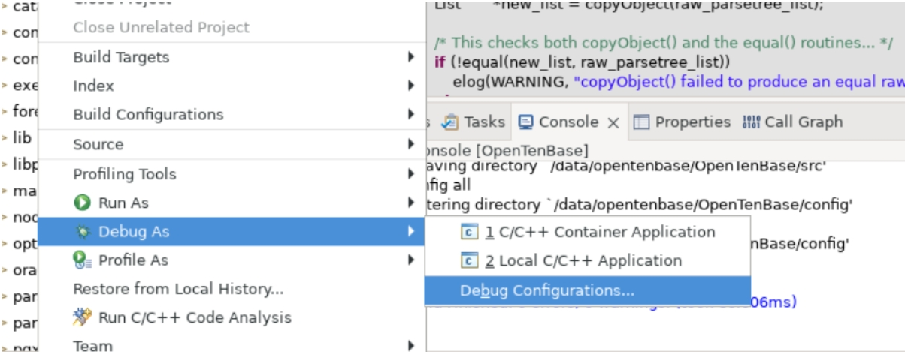
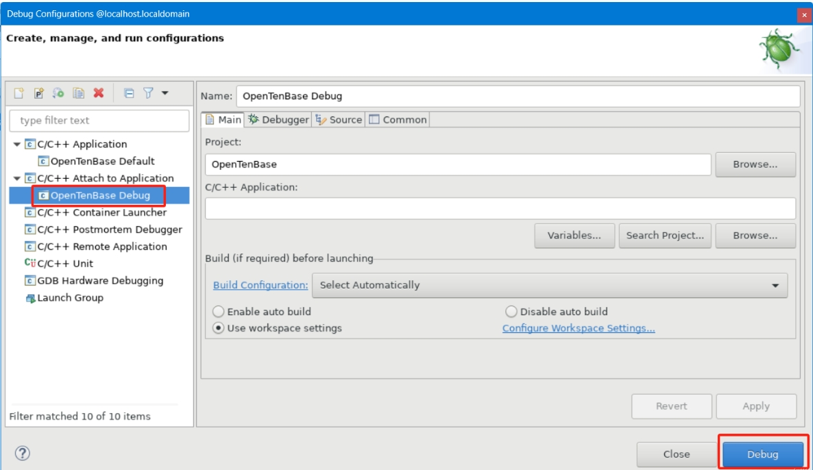
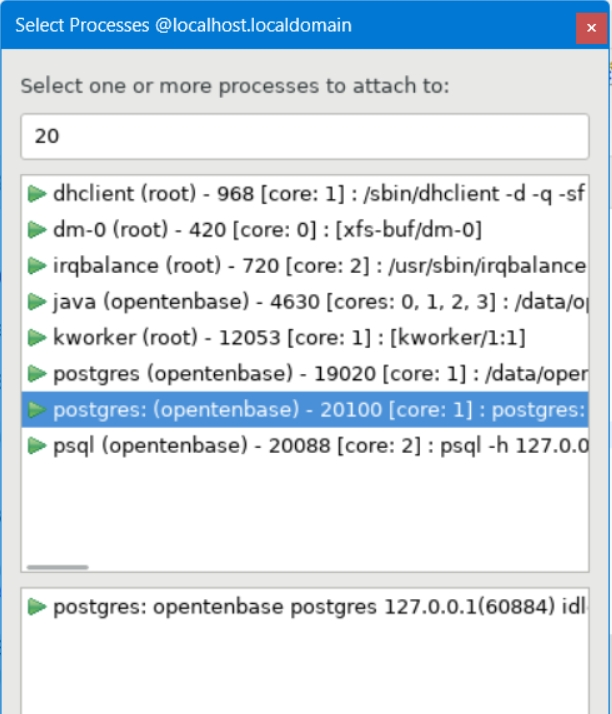

### 设置断点
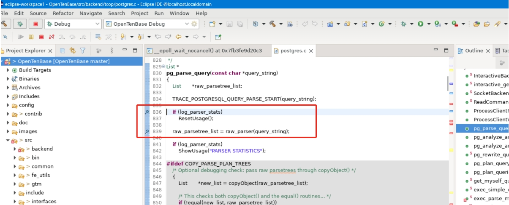

### 执行查询命令，然后查看断点
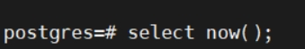
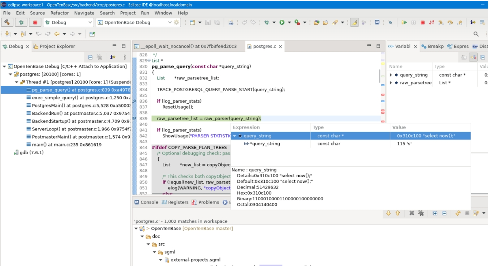

## 开始 OpenTenBase 开发之旅吧。