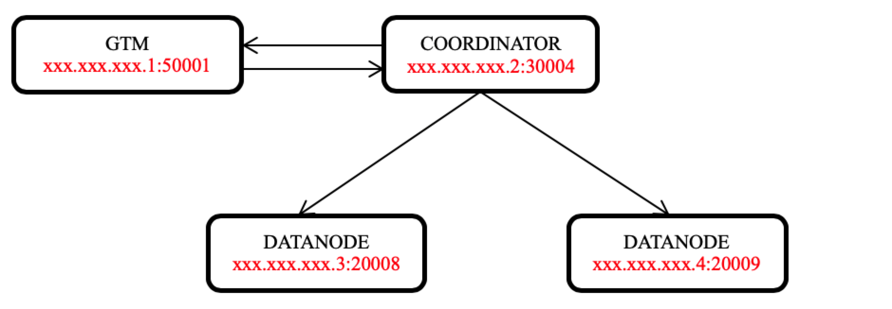

# 单机部署 OpenTenBase
`
本文档为官方主页部署文档的补充，包含详细的部署步骤，以便初学者快速体验 OpenTenBase
`

## 环境准备

- 虚拟机: VirtualBox 7.0
- 分配内存: 4 G
- 分配磁盘: 50 G
- 操作系统: CentOS-7-x86_64

安装软件包
``` bash
yum -y install git gcc make readline-devel zlib-devel openssl-devel uuid-devel bison flex
```

禁用安全设置
``` bash
[root@localhost ~]# vi /etc/selinux/config 
# 设置 SELINUX=disabled
```

关闭防火墙
``` bash
[root@localhost ~]# systemctl disable firewalld
[root@localhost ~]# systemctl stop firewalld
[root@localhost ~]# systemctl status firewalld
● firewalld.service - firewalld - dynamic firewall daemon
   Loaded: loaded (/usr/lib/systemd/system/firewalld.service; disabled; vendor preset: enabled)
   Active: inactive (dead)
     Docs: man:firewalld(1)

```


## 集群规划




## 新建 OpenTenBase 账号

``` bash
[root@localhost ~]# useradd opentenbase
[root@localhost ~]# id opentenbase
uid=1000(opentenbase) gid=1000(opentenbase) groups=1000(opentenbase)
[root@localhost ~]# passwd opentenbase
Changing password for user opentenbase.
New password:
BAD PASSWORD: The password is a palindrome
Retype new password:
passwd: all authentication tokens updated successfully.
```

## 设置 opentenbase 用户本机互信
``` bash
[opentenbase@localhost opentenbase]$ ssh-keygen -t rsa
Generating public/private rsa key pair.
Enter file in which to save the key (/home/opentenbase/.ssh/id_rsa):
Enter passphrase (empty for no passphrase):
Enter same passphrase again:
Your identification has been saved in /home/opentenbase/.ssh/id_rsa.
Your public key has been saved in /home/opentenbase/.ssh/id_rsa.pub.
The key fingerprint is:
SHA256:ZIPaMs3QSOsDIuG9hLsmL0usXHtdGOqeRwqEoKAJgaQ opentenbase@localhost
The key's randomart image is:
+---[RSA 2048]----+
|=o  .            |
|B.o. + .         |
|E+oo+ o +        |
|=oo+.* + .       |
| ...* = S        |
|. .. = o .       |
|.= .o + .        |
|B.. .+.o         |
|o+..oo.          |
+----[SHA256]-----+
```

``` bash
[opentenbase@localhost opentenbase]$ ssh-copy-id 127.0.0.1
/bin/ssh-copy-id: INFO: Source of key(s) to be installed: "/home/opentenbase/.ssh/id_rsa.pub"
/bin/ssh-copy-id: INFO: attempting to log in with the new key(s), to filter out any that are already installed
/bin/ssh-copy-id: INFO: 1 key(s) remain to be installed -- if you are prompted now it is to install the new keys
opentenbase@127.0.0.1's password:

Number of key(s) added: 1

Now try logging into the machine, with:   "ssh '127.0.0.1'"
and check to make sure that only the key(s) you wanted were added.

```

## 下载源码

新建项目路径，并赋权给 opentenbase 用户
``` bash
[root@localhost ~]# mkdir -p /data/opentenbase
[root@localhost ~]# chown -R opentenbase.opentenbase /data/opentenbase
[root@localhost ~]# ll /data
total 0
drwxr-xr-x. 2 opentenbase opentenbase 6 Apr  8 10:43 opentenbase
```

下载源码到 /data/opentenbase 目录
``` bash
[root@localhost opentenbase]# su - opentenbase
[opentenbase@localhost ~]$ cd /data/opentenbase/
[opentenbase@localhost opentenbase]$ git clone https://github.com/OpenTenBase/OpenTenBase.git --depth 0
Cloning into 'OpenTenBase'...
remote: Enumerating objects: 17778, done.
remote: Counting objects: 100% (3291/3291), done.
remote: Compressing objects: 100% (600/600), done.
remote: Total 17778 (delta 2902), reused 2691 (delta 2691), pack-reused 14487
Receiving objects: 100% (17778/17778), 30.92 MiB | 5.73 MiB/s, done.
Resolving deltas: 100% (11101/11101), done.
```

## 配置环境变量

添加如下内容到 /home/opentenbase/.bashrc 文件末尾
``` bash
export SOURCECODE_PATH=/data/opentenbase/OpenTenBase
export INSTALL_PATH=/data/opentenbase/install
export PG_HOME=${INSTALL_PATH}/opentenbase_bin_v2.0
export PATH="$PATH:$PG_HOME/bin"
export LD_LIBRARY_PATH="$LD_LIBRARY_PATH:$PG_HOME/lib"
export LC_ALL=C
export pgxcInstallDir=${INSTALL_PATH}/opentenbase_bin_v2.0
```

应用配置
``` bash
[opentenbase@localhost opentenbase]$ source /home/opentenbase/.bashrc
```

## 源码编译

使用 opentenbase 用户，按顺序执行如下指令：
``` bash
cd ${SOURCECODE_PATH}
rm -rf ${INSTALL_PATH}/opentenbase_bin_v2.0
chmod +x configure*
./configure --prefix=${INSTALL_PATH}/opentenbase_bin_v2.0 --enable-user-switch --with-openssl --with-ossp-uuid CFLAGS=-g
make clean
make -sj
make install
chmod +x contrib/pgxc_ctl/make_signature
cd contrib
make -sj
make install
```

执行完成后，检查程序是否生成
``` bash
[opentenbase@localhost contrib]$ which psql
/data/opentenbase/install/opentenbase_bin_v2.0/bin/psql

[opentenbase@localhost contrib]$ which pg_ctl
/data/opentenbase/install/opentenbase_bin_v2.0/bin/pg_ctl

[opentenbase@localhost contrib]$ which pgxc_ctl
/data/opentenbase/install/opentenbase_bin_v2.0/bin/pgxc_ctl

```

## 集群部署

### 编辑集群配置文件

使用 pgxc_ctl prepare 命令生成集群配置文件
``` bash
[opentenbase@localhost opentenbase]$ pgxc_ctl prepare
/bin/bash
Installing pgxc_ctl_bash script as /home/opentenbase/pgxc_ctl/pgxc_ctl_bash.
ERROR: File "/home/opentenbase/pgxc_ctl/pgxc_ctl.conf" not found or not a regular file. No such file or directory
Installing pgxc_ctl_bash script as /home/opentenbase/pgxc_ctl/pgxc_ctl_bash.
Reading configuration using /home/opentenbase/pgxc_ctl/pgxc_ctl_bash --home /home/opentenbase/pgxc_ctl --configuration /home/opentenbase/pgxc_ctl/pgxc_ctl.conf
Finished reading configuration.
   ******** PGXC_CTL START ***************

Current directory: /home/opentenbase/pgxc_ctl
```

根据规划修改配置文件
``` bash 
[opentenbase@localhost opentenbase]$ vi /home/opentenbase/pgxc_ctl/pgxc_ctl.conf
```

配置文件内容： [pgxc_ctl.conf 下载链接](assets/pgxc_ctl.conf)：
``` bash
#!/usr/bin/env bash

pgxcInstallDir=${PG_HOME}
pgxlDATA=/data/opentenbase/pgxc

pgxcOwner=$USER
pgxcUser=$USER
tmpDir=/tmp
localTmpDir=$tmpDir


# ---- GTM Master ---------------
gtmName=gtm
gtmMasterServer=127.0.0.1
gtmMasterPort=50001
gtmMasterDir=$pgxlDATA/gtm


# ---- Configuration
gtmExtraConfig=none
gtmMasterSpecificExtraConfig=none

# ---- GTM Slave
gtmSlave=y                  # Specify y if you configure GTM Slave.   Otherwise, GTM slave will not be configured and
                            # all the following variables will be reset.
gtmSlaveName=gtmSlave
gtmSlaveServer=127.0.0.1    # value none means GTM slave is not available.  Give none if you don't configure GTM Slave.
gtmSlavePort=50002          # Not used if you don't configure GTM slave.
gtmSlaveDir=$pgxlDATA/gtmSlave    # Not used if you don't configure GTM slave.

#---- Configuration
gtmSlaveSpecificExtraConfig=none

#---- Coordinators ---------
coordMasterDir=$pgxlDATA/coord
coordNames=(cn001) 
coordPorts=(30004)          
poolerPorts=(30011)         
coordPgHbaEntries=(0.0.0.0/0)

coordMasterServers=(127.0.0.1)    
coordMasterDirs=($coordMasterDir/cn001)
coordMaxWALsernder=0
coordMaxWALSenders=($coordMaxWALsernder)

coordSlave=n


#---- Datanodes ----------
datanodeMasterDir=$pgxlDATA/dn_master
primaryDatanode=127.0.0.1
datanodeNames=(dn001 dn002)
datanodePorts=(20008 20009)
datanodePoolerPorts=(20011 20012) 
datanodePgHbaEntries=(0.0.0.0/0)

datanodeMasterServers=(127.0.0.1 127.0.0.1)
datanodeMasterDirs=($datanodeMasterDir/dn001 $datanodeMasterDir/dn002)
datanodeMaxWalSender=0
datanodeMaxWALSenders=($datanodeMaxWalSender $datanodeMaxWalSender)

datanodeSlave=n

```

### 初始化集群

初始化后集群会自动启动。
``` bash
[opentenbase@localhost opentenbase]$ pgxc_ctl init all
```

### 停止/启动集群
``` bash
# 停止
[opentenbase@localhost opentenbase]$ pgxc_ctl stop all
```

``` bash
# 启动
[opentenbase@localhost opentenbase]$ pgxc_ctl start all
```

### 登录集群
``` bash
[opentenbase@localhost opentenbase]$ psql -p 30004 postgres
psql (PostgreSQL 10.0 OpenTenBase V2)
Type "help" for help.

postgres=# 
```

### 新建节点组
``` bash
[opentenbase@localhost opentenbase]$ psql -p 30004 postgres
psql (PostgreSQL 10.0 OpenTenBase V2)
Type "help" for help.

postgres=# create table t1(id int);
ERROR:  default group not defined
postgres=# create default node group default_group  with (dn001,dn002);
CREATE NODE GROUP
postgres=# create sharding group to group default_group;
CREATE SHARDING GROUP
postgres=# create table t1(id int);
CREATE TABLE
postgres=#
```

## 恭喜，可以畅快的体验 OpenTenBase 了