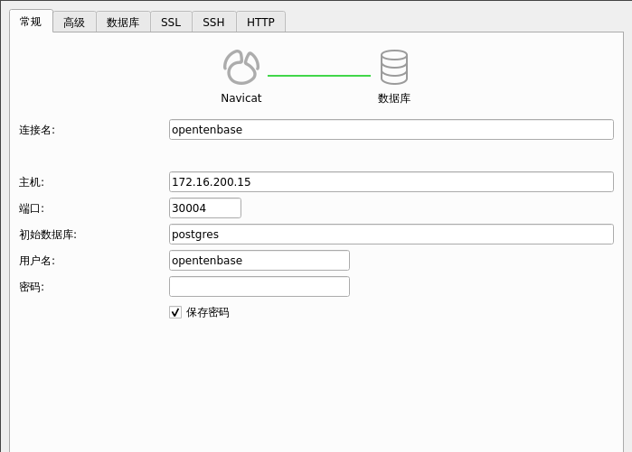

# Running OpenTenBase with Docker

## Quick Start

First, clone the [OpenTenBase repository](https://github.com/OpenTenBase/OpenTenBase)，then navigate to the docker directory.

### 1. Execute the image building script
```bash
./buildImage.sh
```
If the build is successful, you should see the two images marked by red lines as indicated below:


### 2. Start the example service and enter the Host container

```bash
cd example
docker-compose up -d 
docker-compose exec opentenbaseHost /bin/bash
```

### 3. SSH trust configuration

```bash
su opentenbase
copy-ssh-keys
```

Enter "yes", then press Enter. Then enter the password "qwerty".


### 4. Deployment and initialization

Copy the configuration file to the specified directory:
```bash
mkdir ~/pgxc_ctl
cp ~/pgxc_conf/pgxc_ctl.conf ~/pgxc_ctl
```
Use `pgxc_ctl` for deployment. Avoid using commands like `ls` or `echo` after entering `pgxc_ctl`.
```bash
pgxc_ctl                                # This step will enter --home location, which is by default /home/$USER/pgxc_ctl. Type exit to exit or Ctrl + D
deploy all                              # This will use pgxc.conf located in /home/$USER/pgxc_ctl/pgxc.conf for deployment
init all
```
Successful output of deploy all command:

Successful output of init all command:

### 5. After successful deployment 

First, exit `pgxc_ctl` by entering exit and pressing Enter, or Ctrl+D. Then, copy the following command to connect to the database:
```bash
psql -h 172.16.200.10 -p 30004 -d postgres -U opentenbase
```
The following SQL commands are explained in detail in the [Quick Start](https://docs.opentenbase.org/guide/01-quickstart/#_3) section of the documentation:
```sql
-- Using dn001 and dn002 as storage nodes to form the default storage group
create default node group default_group  with (dn001,dn002); 
create sharding group to group default_group;      -- Setting up the storage group for tables of shard type
create database test;                              -- Creating the test database
create user test with password 'test';             -- Creating a user test with password test
alter database test owner to test;                 -- Changing the owner of the test database to the user test
\c test test                                       -- Switching to the test database
-- Creating a shard table foo, using id as the distribution key
create table foo(id bigint, str text) distribute by shard(id);
insert into foo values(1, 'tencent'), (2, 'shenzhen');
select * from foo;
```

After successful deployment, you can continue to explore other content in the official documentation.

### 6. Connection with Navicat

Connect using Navicat:



Open then foo table:


You are now connected and can create queries to practice other content in the documentation.

## Container Structure

### 1. OpenTenBase and OpenTenBaseBase images

Both images are based on Ubuntu 20.04.

- The OpenTenBase image installs the OpenTenBase database and the vim editor.
- Volumes are mapped from ./pgxc_conf to /home/opentenbase/pgxc_conf.
- SSH keys are located in /home/opentenbase/.ssh for both root and opentenbase users with the password "qwerty".
- The OpenTenBase image includes a script copy-ssh-keys located in ./host/copy-ssh-keys.

### 2. Creation of the opentenbase user
```bash
RUN useradd -m -r -s /bin/bash opentenbase # -m creates the home directory immediately, -r creates a system user, -s specifies the shell path
RUN echo 'opentenbase:qwerty' | chpasswd   # Sets the password for the opentenbase user to qwerty```

### 3. ssh 互信设置

During building, SSH key pairs are created in /home/opentenbase/.ssh using the following commands:

```bash
RUN su opentenbase                                           # Switch to the opentenbase user
RUN mkdir /home/opentenbase/.ssh -p
RUN ssh-keygen -t rsa -f /home/opentenbase/.ssh/id_rsa -N '' # Generate SSH key pairs
```
After container startup, execute `docker-compose exec opentenbaseHost /bin/bash` to enter the Host container, then execute `ssh-copy-keys` to copy the keys between the two Base containers, establishing SSH trust.

### 4. pgxc_ctl.conf file

The ./pgxc_conf directory contains configuration files. The [official double node configuration](../guide/pgxc_ctl_double.conf) file is used, with modifications to the IP_1 and IP_2 parameters.

### 5. OpenTenBase compilation and installation

Only the Host container has pgxc installed. Paths are as follows, with compilation steps detailed in the [official repository](https://github.com/OpenTenBase/OpenTenBase) README:

```bash
ENV SOURCECODE_PATH=/data/opentenbase/OpenTenBase
ENV INSTALL_PATH=/data/opentenbase/install
```
For Ubuntu systems, the PATH is written to /etc/environment:
```bash
RUN echo "PATH=\"/data/opentenbase/install/opentenbase_bin_v2.0/bin:$PATH\"" >> /etc/environment 
```
### 6. Example service

- Containers are connected through a bridge network with a subnet mask of 172.16.200.0/26 and a gateway of 172.16.200.1.
- The Host container has an IPv4 address of 172.16.200.5, while the two Base containers have IPv4 addresses of 172.16.200.10 and 172.16.200.15 respectively.


