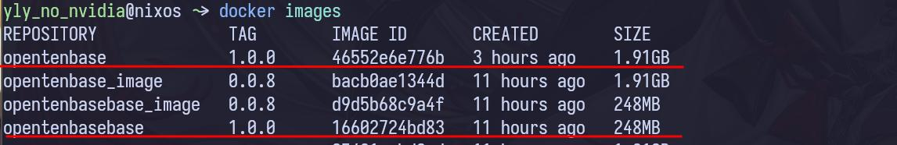
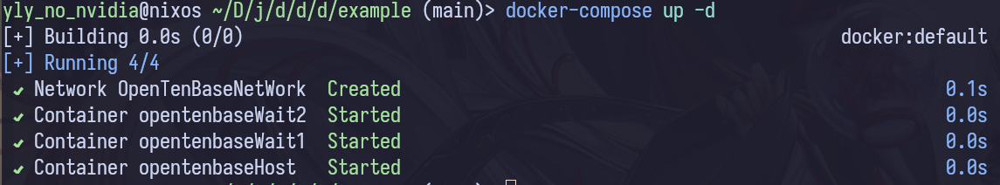
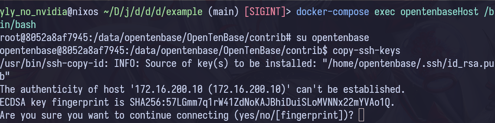
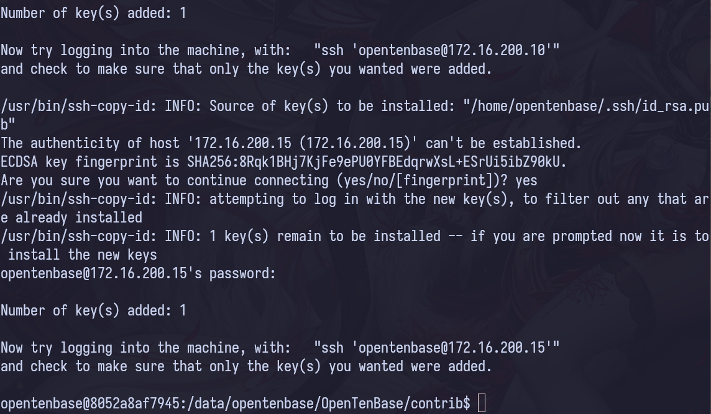
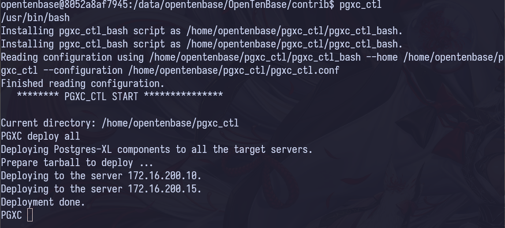
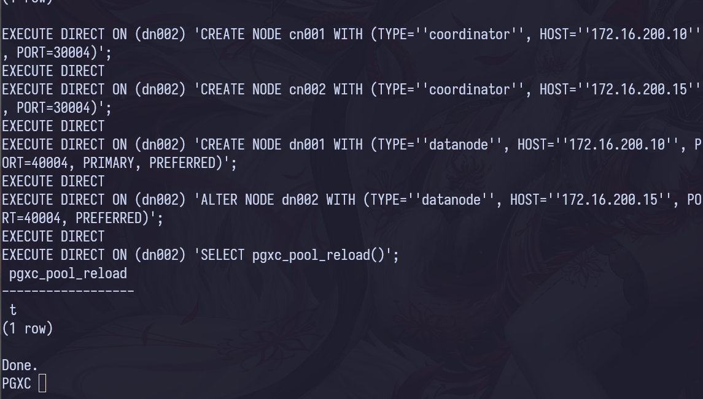
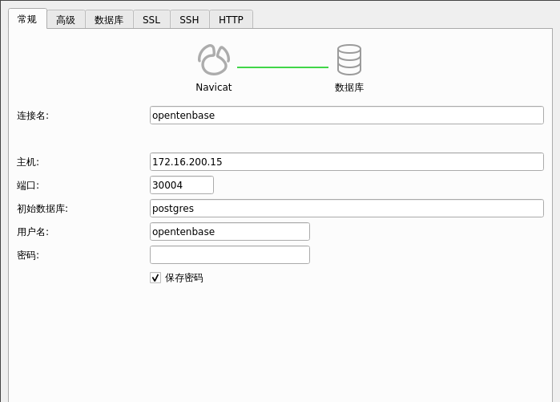
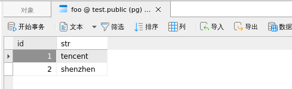

# docker 运行 OpenTenBase

## 快速启动

首先 clone [OpenTenBase 仓库](https://github.com/OpenTenBase/OpenTenBase)，然后进入到 docker 目录中。

### 1. 执行镜像构建脚本
```bash
./buildImage.sh
```
如果构建成功就可看到，红线标明的两个镜像:


### 2. 启动 example 服务，进入 Host 容器

```bash
cd example
docker-compose up -d 
docker-compose exec opentenbaseHost /bin/bash
```

### 3. SSH 互信配置

```bash
su opentenbase
copy-ssh-keys
```

输入 "yes"，然后回车。然后输入密码 "qwerty"。


### 4. 部署和初始化
复制配置文件到指定目录:
```bash
mkdir ~/pgxc_ctl
cp ~/pgxc_conf/pgxc_ctl.conf ~/pgxc_ctl
```
使用 pgxc_ctl 进行部署，使用 pgxc_ctl 之后，不要敲 ls,echo 这种命令。
```bash
pgxc_ctl                                # 这一步会进入 --home 位置，默认是/home/$USER/pgxc_ctl, 使用exit退出，或者ctrl + d
deploy all                              # 会使用/home/$USER/pgxc_ctl/pgxc.conf 这个配置文件
init all
```
deploy all 成功的命令输出:

init all 成功的命令输出:

### 5. 部署成功后 

先退出 `pgxc_ctl`，输入 exit 回车，或者 ctrl+d，然后复制下面指令连接到数据库
```bash
psql -h 172.16.200.10 -p 30004 -d postgres -U opentenbase
```
这一段 sql 在[快速入门](https://docs.opentenbase.org/guide/01-quickstart/#_3)有详细的解释:
```sql
-- 使用 dn001, dn002 存储节点组成默认存储组
create default node group default_group  with (dn001,dn002); 
create sharding group to group default_group;      -- 设置 shard 类型的表使用的存储组
create database test;                              -- 创建 test 数据库
create user test with password 'test';             -- 创建一个 test 用户密码为 test
alter database test owner to test;                 -- 修改 test 数据库 owner 为 test 用户
\c test test                                       -- 切换到 test 数据库
-- 创建一个 shard 表 foo, 使用 id 作为分布键
create table foo(id bigint, str text) distribute by shard(id);
insert into foo values(1, 'tencent'), (2, 'shenzhen');
select * from foo;
```


部署成功后, 可以继续看官方文档的快速入门然后可以练习官方文档其他的内容了。

### 6. navicat 连接

navicat 连接:


打开 foo 表:



然后这样连接上了，然后就可以新建查询，练习文档中的其他内容了。

## 容器结构

### 1. OpenTenBase 和 OpenTenBaseBase 镜像

这两个镜像都是基于 ubantu 20.04 制作的。 

- OpenTenBase 镜像安装了 OpenTenBase 数据库 和 vim 编辑器。
- volumes 映射 ./pgxc_conf:/home/opentenbase/pgxc_conf
- SSH keys 都在 /home/opentenbase/.ssh 中
- root 用户和 opentenbase 用户密码都是 qwerty
- OpenTenBase 镜像有 copy-ssh-keys 脚本，脚本就在 ./host/copy-ssh-keys

### 2. 创建 opentenbase 用户
```bash
RUN useradd -m -r -s /bin/bash opentenbase # -m 表示立即创建家目录， -r 表示系统用户，-s 指定shell 路径
RUN echo 'opentenbase:qwerty' | chpasswd   # 设置 opentenbase 用户密码为 qewrty
```

### 3. ssh 互信设置
在构建时，通过这些命令，在 /home/opentenbase/.ssh 创建密钥对。


```bash
RUN su opentenbase                                           # 切换到 opentenbase 用户
RUN mkdir /home/opentenbase/.ssh -p
RUN ssh-keygen -t rsa -f /home/opentenbase/.ssh/id_rsa -N '' # 生成ssh密钥对
```
当容器启动后，执行 docker-compose exec opentenbaseHost /bin/bash 进入 Host 容器，然后执行 ssh-copy-keys 拷贝两个 Base 容器的 key。拷贝完成后SSH互信就建立。

### 4. pgxc_ctl.conf 文件
./pgxc_conf 目录下有配置文件，使用[官方双节点配置文件](../guide/pgxc_ctl_double.conf),就是修改了 IP_1, IP_2 这两个参数。

### 5. OpenTenBase 编译安装
只有 Host 容器有 pgxc 安装。路径在下面，编译流程[官方仓库](https://github.com/OpenTenBase/OpenTenBase)README 有写
```bash
ENV SOURCECODE_PATH=/data/opentenbase/OpenTenBase
ENV INSTALL_PATH=/data/opentenbase/install
```
ubuntu 系统需要写入 PATH 到/etc/environment
```bash
RUN echo "PATH=\"/data/opentenbase/install/opentenbase_bin_v2.0/bin:$PATH\"" >> /etc/environment 
```
### 6. example 服务

- 容器之间有一个网桥，子网掩码是 172.16.200.0/26, 网关是 172.16.200.1。
- Host 容器 ipv4 地址 172.16.200.5, 两个 Base 容器 ipv4 地址分别是 172.16.200.10, 172.16.200.15。 

