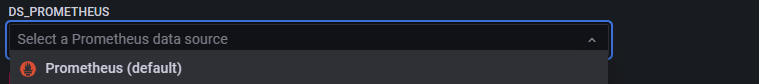

This monitoring will use Prometheus, Grafana visualization tools, and postgres_exporter to comprehensively monitor and optimize OpenTenBase.

#  Install

Environment dependency: Docker

## Install Prometheus

When performing monitoring optimization, you can download the latest version from the official Prometheus website:https://prometheus.io/download/

You can choose to download the source code and unzip it for use, or you can directly start it through Docker. This tutorial will focus on deploying quickly using Docker.

Execute the command:

`docker run -d -p 9090:9090 -v /etc/prometheus:/etc/prometheus prom/prometheus`

After mounting is completed, please make necessary modifications to the configuration file to ensure proper system monitoring.

`vim prometheus.yml`

```yaml
# my global config
global:
  scrape_interval: 15s # Set the scrape interval to every 15 seconds. Default is every 1 minute.
  evaluation_interval: 15s # Evaluate rules every 15 seconds. The default is every 1 minute.
  # scrape_timeout is set to the global default (10s).

# Alertmanager configuration
alerting:
  alertmanagers:
    - static_configs:
        - targets:
          # - alertmanager:9093

# Load rules once and periodically evaluate them according to the global 'evaluation_interval'.
rule_files:
  # - "first_rules.yml"
  # - "second_rules.yml"

# A scrape configuration containing exactly one endpoint to scrape:
# Here it's Prometheus itself.
scrape_configs:
  # The job name is added as a label `job=<job_name>` to any timeseries scraped from this config.
  - job_name: "prometheus"

    # metrics_path defaults to '/metrics'
    # scheme defaults to 'http'.

    static_configs:
      - targets: ["192.168.56.10:9090"]
  # Mainly change here, add scanning in file format
  - job_name: "node"
    file_sd_configs:
    - refresh_interval: 10s
      files:
      - "/etc/prometheus/conf/node*.yaml"
```

Currently, Prometheus's configuration uses file-based service discovery. When modifying the configuration, there is no need to restart, the system will automatically update and take effect, with an update interval of 10 seconds.

To modify the relevant configuration files, first create a directory named conf (`mkdir conf`), then navigate to the directory using the cd command (`cd /etc/prometheus/conf`), and then use the vim editor to edit the file (`vim node-ms.yaml`).

```yaml
- targets:
  - "ip:port"
  labels:
    hostname: pg
```

To customize the configuration information, please modify the corresponding IP address and hostname to your own information. After making the modifications, start the Prometheus service, then you can access http://yourIPAddress:9090/ to view the monitoring data of Prometheus.

## Install Grafana

To ensure the persistence of the configuration, we can start Grafana in a Docker container in a persistent manner. You can use the following command to start the Grafana container and preserve the configuration information after the container restarts:

`docker run -d -p 3000:3000 --name=grafana   --volume grafana-storage:/var/lib/grafana  grafana/grafana-enterprise`

After startup, you can enter http://yourIPAddress:3000/ in the browser.

To log in and view the Grafana monitoring interface, use the default username and password admin/admin.

### Configure data source


Here, you just need to fill in the URL (http://ip:9090/) to save the configuration. This URL points to the address of Prometheus. Grafana will use this address to establish a connection with Prometheus, in order to retrieve data for displaying on the monitoring dashboard.


## Install Exporter

The official Prometheus website provides a variety of Exporters. You can find relevant information at https://prometheus.io/docs/instrumenting/exporters/.

We can install postgres_exporter to monitor the database. The official address is https://github.com/prometheus-community/postgres_exporter.

Similarly, you can start it with Docker:

`docker run  --net=host  -e DATA_SOURCE_NAME="postgresql://opentenbase:@ip:port/postgres?sslmode=disable"  quay.io/prometheuscommunity/postgres-exporter`

Change the IP and host to your own information, in the official example, no login password is set for the opentenbase user, and we also do not set a password for login.

After starting up, we first log in to the database, and then proceed with the relevant settings for the database users.

```sql
CREATE OR REPLACE FUNCTION __tmp_create_user() returns void as $$
BEGIN
  IF NOT EXISTS (
          SELECT                       -- SELECT list can stay empty for this
          FROM   pg_catalog.pg_user
          WHERE  usename = 'postgres_exporter') THEN
    CREATE USER postgres_exporter;
  END IF;
END;
$$ language plpgsql;
```

```sql
SELECT __tmp_create_user();

DROP FUNCTION __tmp_create_user();

ALTER USER postgres_exporter WITH PASSWORD 'password';

ALTER USER postgres_exporter SET SEARCH_PATH TO postgres_exporter,pg_catalog;

GRANT CONNECT ON DATABASE postgres TO postgres_exporter;

-- The PostgreSQL version integrated in OpenTenBase is 10, so you can execute the following statement, and you can check the historical versions on the open source repository.
GRANT pg_monitor to postgres_exporter;
```

# Configure monitoring dashboard

Once all components are successfully started, next we need to go to the marketplace to find the monitoring dashboards we want. You can visit Grafana's official dashboard marketplace at: https://grafana.com/grafana/dashboards/?search=postgresql


Once you find a dashboard you like, click here to import it. Use ID: 9628 as an example for the import process.

Choose our data source here.



Let's see how it looks in action:

