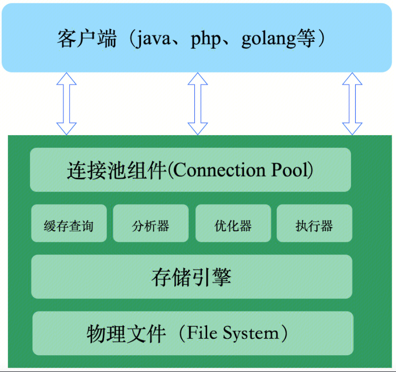

# 一、总体架构
TXSQL内核基于[MySQL 8.0开源版本](https://dev.mysql.com/doc/refman/8.0/en/)进行开发，TXSQL总体架构与MySQL保持一致，总体上分为三层：连接层、服务层和存储引擎层。


- 连接层主要负责与客户端的连接建立与请求接收。同时负责安全权限认证，连接资源管理、线程管理等模块功能。

- 服务层主要包括以下核心模块：

| | |
|:--| :--|
| **模块**	| **作用** |
|查询缓存  | 命中缓存则直接返回结果 |
|SQL解析器 | 对客户端发送的SQL进行词法分析，语法分析 |
|查询优化器 | 负责生成执行计划、索引选择 |
|执行器| 操作存储引擎，返回结果|


- 存储引擎层负责数据的存储和提取。支持多种存储引擎，如InnoDB、MyiSam、Memory等，用户可根据实际需求进行选择。默认存储引擎为能够支持事务ACID、支持行锁、支持外检约束的InnoDB引擎。存储引擎对上负责执行服务层发送的数据查找和数据修改操作，向下与物理文件进行交互，实现数据的存储与修改需求。

- 物理系统是指 TXSQL 如何将逻辑存储结构映射到磁盘上的文件系统。


# 二、模块设计

## 1. 连接层

连接层负责跟客户端建立连接、获取权限、维持和管理连接。

- **连接建立与处理：**
连接命令中的 TXSQL 是客户端工具，用来跟服务端建立连接。在完成经典的 TCP 握手后，连接器就要开始认证你的身份，这个时候用的就是你输入的用户名和密码。
若账户验证失败，返回“Access denied for user”；如果验证成功，连接器会到权限表里面查出你拥有的权限。（修改权限不会影响已经存在的连接）。

- **连接资源管理：**
TXSQL支持配置最大连接数，当连接数量到达最大值时，新的连接请求会被拒绝。客户端如果太长时间没操作，连接器就会自动将它断开。这个时间是由参数 wait_timeout 控制的，默认值是 8 小时。

- **线程管理**：
在不使用线程池的情况下，TXSQL会为每一个连接创建一个线程，用于处理该连接在数据库中的操作，以及管理该连接的上下文信息，包括事务、参数以及临时表等信息。在使用线程池的情况下，会有固定数量的线程用来被调度处理不同连接到来的请求，线程池能够避免大量并发线程的创建、切换与销毁带来的开销。

## 2. 服务层
### 查询缓存
连接建立完成后，你就可以执行 SQL语句了。此时执行逻辑就会来到第二步：查询缓存。

TXSQL 拿到一个查询请求后，会先到查询缓存看看，之前是不是执行过这条语句。之前执行过的语句及其结果可能会以 key-value 对的形式，被直接缓存在内存中。key 是查询的语句，value 是查询的结果。如果你的查询能够直接在这个缓存中找到 key，那么这个 value 就会被直接返回给客户端。如果语句不在查询缓存中，就会继续后面的执行阶段。执行完成后，执行结果会被存入查询缓存中。

但是大多数情况不推荐使用查询缓存，因为查询缓存往往弊大于利。查询缓存的失效非常频繁，只要有对一个表的更新，这个表上所有的查询缓存都会被清空。
对于更新压力大的数据库来说，查询缓存的命中率会非常低。

TXSQL 也提供了这种“按需使用”的方式。你可以将参数 query_cache_type 设置成 DEMAND(修改my.cnf并重启)，这样对于默认的 SQL 语句都不使用查询缓存。

### SQL解析器

如果没有命中查询缓存，就要开始真正执行语句了。首先，TXSQL 需要知道你要做什么，因此需要对 SQL 语句做解析。

解析器先会做“词法分析”。你输入的是由多个字符串和空格组成的一条 SQL 语句，TXSQL 需要识别出里面的字符串分别代表什么含义；

例如：TXSQL 从你输入的"select"这个关键字识别出来，这是一个查询语句。它也要把字符串“Table”识别成“表名 T”，把字符串“ID”识别成“列 ID”。

做完了这些识别以后，就要做“语法分析”。根据词法分析的结果，语法分析器会根据语法规则，判断你输入的这个 SQL 语句是否满足 TXSQL 语法。

如果你的语句不对，就会收到类似“You have an error in your SQL syntax; xxxxxx”的错误提醒;
```
TXSQL> seelect * from p_nic where Id = 1;ERROR 1064 (42000): You have an error in your SQL syntax; check the manual that corresponds to your sql server version for the right syntax to use near 'seelect * from p_nic where Id = 1' at line 1
```
一般语法错误会提示第一个出现错误的位置，所以你要关注的是紧接“use near”的内容。

### 查询优化器

经过了解析器，TXSQL 就知道你要做什么了。在开始执行之前，还要先经过优化器的处理。

优化器是在表里面有多个索引的时候，决定使用哪个索引；或者在一个语句有多表关联（join）的时候，决定各个表的连接顺序。

比如你执行下面这样的语句：
```
select * from p_cpu join server_physical_info using(SvrAssetId) where p_cpu.SN = 'sn1' and server_physical_info.SvrIsSpecial=1;
```
既可以先从表 p_cpu 里面取出 SN='sn1'的记录的 SvrAssetId，再根据 SvrAssetId 值关联到表 server_physical_info， 再判断 server_physical_info 里面 SvrIsSpecial 的值是否等于 1。也可以先从表 server_physical_info里面取出SvrIsSpecial=1的记录的SvrAssetId值，再根据 SvrAssetId 值关联 p_cpu，再判断 p_cpu里面sn的值是否等于sn1。这两种执行方法的逻辑结果是一样的，但是执行的效率会有不同，而优化器的作用就是根据代价估计来决定选择使用哪一个方案。

### 执行器

TXSQL 通过SQL解析器知道了你要做什么，通过查询优化器知道了该怎么做，于是就进入了执行器阶段，开始执行语句。

开始执行的时候，要先判断一下你对这个表 T 有没有执行查询的权限，如果没有，就会返回没有权限的错误。如果有权限，就打开表继续执行。打开表的时候，执行器就会根据表的引擎定义，去使用这个引擎提供的接口。
对于查询条件 sn 若没有索引，执行器的执行流程大概是这样：
1、调用引擎接口表的第一行，判断 sn 是否匹配，不匹配则跳过，匹配则将该行存在结果集中；
2、调用引擎接口取下一行，重复直到取到表的最后一行；
3、将结果集返回客户端；
对于查询条件 sn 若有索引，执行逻辑类似，只是第一次调用的是“取满足条件的第一行”这个接口，之后循环取“满足条件的下一行”这个接口，这些接口都是引擎中已经定义好的；

## 3. 存储引擎层
存储引擎层负责存储数据和执行服务层的请求。TXSQL默认使用InnoDB存储引擎。InnoDB引擎是一个事务型存储引擎，提供了对数据库 ACID 事务的支持，并实现了 SQL 标准的四种隔离级别，具有行级锁定（这一点说明锁的粒度小，在写数据时，不需要锁住整个表，因此适用于高并发情形）及外键支持（所有数据库引擎中独一份，仅有它支持外键）该引擎的设计目标便是处理大容量数据的数据库系统。

InnoDB的底层结构主要由两部分组成：内存结构和物理文件。

### 内存结构
- 缓冲池（Buffer Pool）：在内存中缓存数据页及索引页，用于加快访问速度。当缓冲池不能存下所有的数据页时，页面淘汰算法就显得尤为重要。
- 更改缓冲区（Change Buffer）：用于缓存非聚集索引的修改操作，减少磁盘IO。对非聚集索引的修改由于不需要检查唯一性，因此可以先缓存在内存中，当需要读取的时候或者更改缓冲区到达一定大小时或者缓冲池中的数据需要被刷新到磁盘中时，再将数据进行合并操作。
- 自适应哈希索引（Adaptive Hash Index）：主要用于加速索引查询效率。InnoDB根据查询频率和查询的模式建立的哈希索引，可以根据哈希函数快速定位到数据页的位置。由于哈希表的查找效率比btree高，所以能够提高数据查找的效率。
- 日志缓冲区（Log Buffer）：主要用于缓存事务的redo log，保证事务的持久性。日志缓冲区的大小受参数innodb_log_buffer_size控制。当事务提交时，会将日志缓冲区的日志刷到日志文件中去，刷新策略受innodb_flush_log_at_trx_commit控制。

### 物理文件
TXSQL的物理文件主要有如下集中类型：
- 数据文件（data file）是存储引擎存储数据的主要文件，它是由一个或多个固定大小的数据页（data page）组成的文件，每个数据页的大小默认为16KB。数据文件可以是单个文件（ibdata1）或多个文件（ibdata1, ibdata2, …），也可以是按表分割的文件（table_name.ibd）。数据文件中存储了表的数据、索引、元数据等信息。
- 日志文件（log file）是存储日志的主要文件，它是由两个或多个固定大小的日志段（log segment）组成的循环文件，每个日志段的大小默认为48MB。日志文件可以是单个文件（ib_logfile0）或多个文件（ib_logfile0, ib_logfile1, …）。日志文件中存储了事务的修改记录，用于保证事务的持久性和原子性。
- 索引文件（index file）是存储索引的辅助文件，它是由一个或多个固定大小的索引页（index page）组成的文件，每个索引页的大小默认为16KB。索引文件可以是单个文件（table_name.MYI）或多个文件（table_name.MYI, table_name.MYI.1, …）。索引文件中存储了表的辅助索引，用于加速数据查询和排序等操作。
- 临时文件（temp file）是存储临时数据的辅助文件，它是由一个或多个固定大小的临时页（temp page）组成的文件，每个临时页的大小默认为16KB。临时文件可以是单个文件（ibtmp1）或多个文件（ibtmp1, ibtmp2, …）。临时文件中存储了查询过程中产生的临时表、排序结果、分组结果等信息。