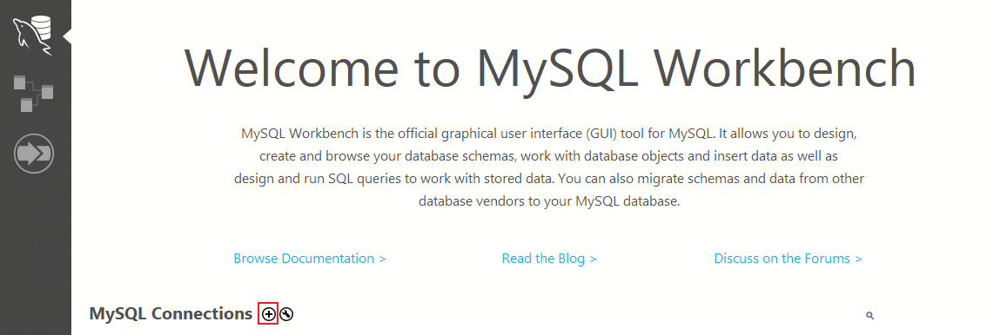
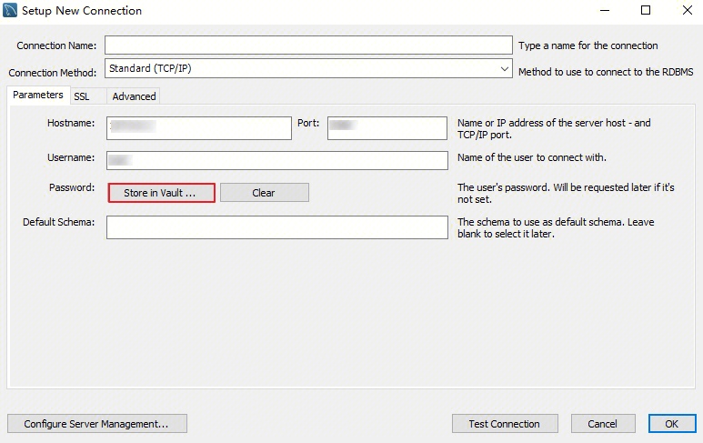

## 使用命令行连接 TXSQL 
1.以下是基于 linux 环境 cenos 系统，介绍如何安装 mysql client：
```shell
yum install mysql
```
2.安装完成后，你可以使用如下命令连接到 TXSQL
```shell
mysql -h <IP 地址> -u <用户名，默认 root> -P <端口号，默认3306> -p 
```
## 使用 GUI 工具连接 TXSQL 
1. 安装 MySQL Workbench，官方下载地址请参见 [MySQL Workbench](https://dev.mysql.com/downloads/)
2. 进入下载页面后单击 **MySQL Workbench。**
3. 跳转页面后在 Windows (x86, 64-bit), MSI Installer 后单击 **Downloads**。
4. 单击 **No thanks, just start my download**。
5. 安装完成后打开 MySQL Workbench，在 MySQL Connections 后单击加号添加待连接的实例信息。



6. 在弹出的窗口下，完成如下配置后，单击**ok**。


## 使用应用程序连接 TXSQL 
### c++
```c++
#include <stdio.h> 
#include <mysql.h> 

int main(void){
	MYSQL mysql; // mysql 连接句柄
	MYSQL_RES* res; // 结果集
	MYSQL_ROW row; // 一行记录
	
	// 配置 TXSQL 连接参数 
	const char *host = '';
	unsinged int port = ;
	const char * user = '';
	const char *password = '';
	const char *db_name = '';
	mysql_init(&mysql);

    if (mysql_real_connect(&mysql, host, user, password, db_name, port, NULL, 0) == NULL) {
        printf("连接失败！： %s\n", mysql_error(&mysql));
        exit(-1);
    }
	int ret = mysql_query(&mysql, "select * from student;");
	
	res = mysql_store_result(&mysql);
	int fields_num = mysql_num_fields(res);

	while(row = mysql_fetch_row(res)){
		for(int i=0;i<fields_num;i++){
			print("%s\t", row[i]);
		}
		print("\n");
	}
	
	mysql_close(&mysql);
	return 0;
}
```
### java
前置准备：以maven项目为例，在 pom.xml 文件中添加 jdbc 依赖
```xml
 <dependencies>
     <dependency>
         <groupId>mysql</groupId>
         <artifactId>mysql-connector-java</artifactId>
         <version>8.0.18</version>
     </dependency>
 </dependencies>
```
```java
import java.sql.Connection;
import java.sql.DriverManager;
import java.sql.PreparedStatement;
import java.sql.ResultSet;
import java.sql.SQLException;

public class SelectDemo {
    public static void main(String[] args) throws ClassNotFoundException, SQLException {
		String url= "jdbc:mysql://<Host>:<Port>/<Database>";  
		String username = "";         
		String password = "";
        //1.注册数据库的驱动
        Class.forName("com.mysql.jdbc.Driver");
        //2.获取数据库连接
        Connection connection = DriverManager.getConnection(url,username,password);
        //3.需要执行的sql语句（?是占位符，代表一个参数）
        String sql = "select * from student where name = ?";
        //4.获取预处理对象，并依次给参数赋值
        PreparedStatement statement = connection.prepareStatement(sql);
	        statement.setString(1,"Tom"); 
		// 5. 查询数据
        ResultSet resultSet = statement.executeQuery();
        System.out.println(resultSet.get("name"));
		
        //6.关闭jdbc连接
        statement.close();
        connection.close();
    }
}

```
### go
前置准备：安装 gorm
```shell
go get -u gorm.io/gorm
```
```go
package main

import (
"gorm.io/gorm"
"gorm.io/driver/mysql"
)

type Student struct{
	Name string
	Age int
}

func main(){

	// 配置 TXSQL 连接参数 
	username := ""  // 用户名
	password := ""  // 密码
	host := ""    // IP 地址
	port :=      // 端口
	dbname := ""  // 库名

	dsn := fmt.Sprintf("%s:%s@tcp(%s:%d)/%s?charset=utf8&parseTime=True&loc=Local", username, password, host, port, dbname)        
	db, err := gorm.Open(mysql.Open(dsn), &gorm.Config{}) 
	if err != nil { 
		panic("连接数据库失败, error=" + err.Error()) 
	}
	defer db.close()
	
	var stu Student
	db.First(&stu)
}
```
### python
前置准备：安装 pymysql
```shell
## python3 
pip3 install PyMySQL
## python2
pip install pymysql
```
```python
import pymysql

# 打开连接 
connection = pymysql.connect(host='', 
					 user='',  
					 password='', 
					 database='') 
# 获取一个游标对象 cursor 
cursor = connection.cursor() 
# 执行 SQL 查询  
cursor.execute("SELECT * from student") 
# 获取单条数据
data = cursor.fetchone()

# 关闭连接 
connection.close()
```