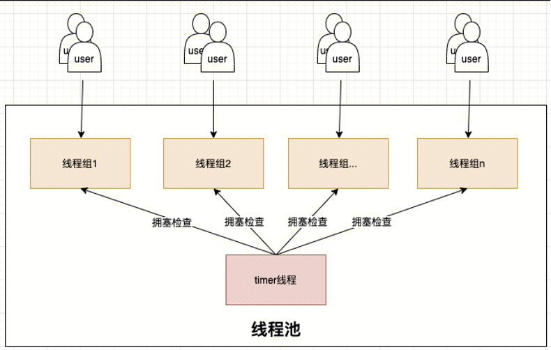
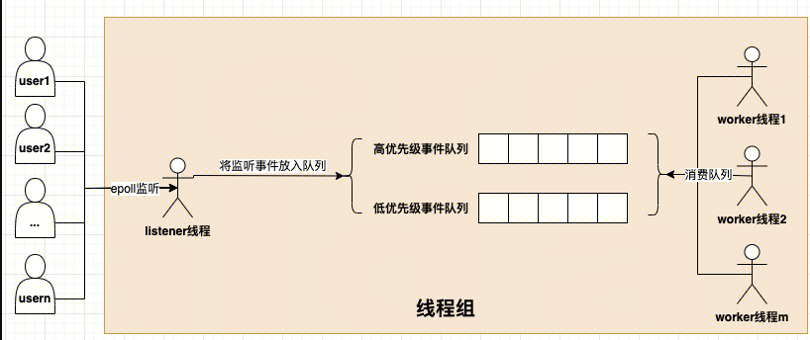
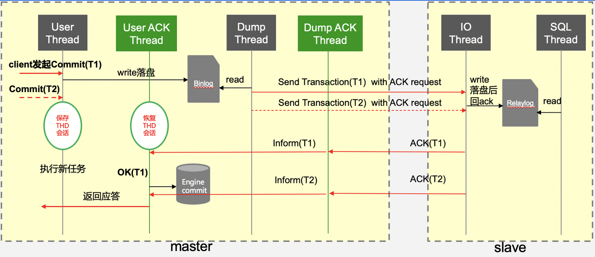
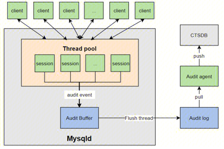
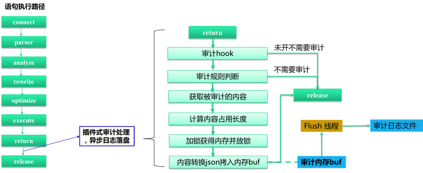

## 线程池
### 概述
社区版 MySQL 的连接处理方法默认是为每个连接创建一个工作线程的 one-thread-per-connection（Per_thread）模式。这种模式下，由于系统的资源是有限的，随着连接数的增加，资源的竞争也增加，连接的响应时间也随之增加。
对于数据库整体吞吐而言，则是在资源未耗尽时随着连接数增加，一旦连接数超过了某个耗尽系统资源的临界点，数据库整体吞吐就会随着各连接的资源争抢而下降。
如何避免在连接数暴增时，因资源竞争而导致系统吞吐下降的问题呢？TDSQL中给出了简洁的答案：线程池。线程池的思路即为限制同时运行的线程数，减少线程池间上下文切换和热锁争用，从而对 OLTP 工作负载（CPU消耗较少的查询）产生积极影响。当连接数上升时，在线程池的帮助下数据库整体吞吐维持在一个较高水准。
### 原理
线程池的基本原理为：预先创建一定数量的工作线程（worker 线程）。在线程池监听线程（listener 线程）从现有连接中监听到新请求时，从工作线程中分配一个线程来提供服务。工作线程在服务结束之后不销毁线程，而是保留在线程池中继续等待下一个请求来临。面我们将从线程池架构、新连接的创建与分配、listener 线程、worker 线程、timer 线程等几个方面来介绍线程池的实现。
#### 线程池架构
线程池由多个线程组（thread group）和timer线程组成，如下图所示。线程组的数量是线程池并发的上限，通常而言线程组的数量需要配置成数据库实例的CPU数量，从而充分利用CPU。线程池中还有一个服务于所有线程组的timer线程，负责周期性检查线程组是否处于阻塞状态。当检测到阻塞的线程组时，timer线程会通过唤醒或创建新的工作线程来让线程组恢复工作。


线程组（thread group）： 内部由多个worker线程、0或1个listener线程、高低优先级事件队列（由网络事件event构成）、mutex、epollfd、统计信息等组成。如下图所示：


#### 新连接的创建与分配
新连接接入时，线程池按照新连接的线程 ID 取模线程组个数来确定新连接归属的线程组。 
选定新连接归属的线程组后，新连接申请被作为事件放入低优先级队列中，等待线程组中 worker 线程将高优先级事件队列处理完后，就会处理低优先级队列中的请求。
#### listener 线程
listener 线程是负责监听连接请求的线程，每个线程组都有一个 listener 线程。线程池的 listene r采用 epoll 实现。当 epoll监听到请求事件时，listener 会根据请求事件的类型来决定将其放入哪个优先级事件队列。
#### worker 线程
worker 线程是线程池中真正干活的线程，正常情况下，每个线程组都会有一个活跃的 worker 线程。worker 在理想状态下，可以高效运转并且快速处理完高低优先级队列中的事件。但是在实际场景中，worker 经常会遭遇 IO、锁等等待情况而难以高效完成任务，此时任凭 worker 线程等待将使得在队列中的事件迟迟得不到处理、甚至可能出现长时间没有 listener 线程监听新请求的情况。为此，每当 worker 遭遇 IO、锁等等待情况，如果此时线程组中没有 listener 线程或者高低优先级事件队列非空，并且没有过多活跃 worker，则会尝试唤醒或者创建一个 worker。为了避免短时间内创建大量 worker，带来系统吞吐波动，线程池创建 worker 线程时有一个控制单位时间创建 worker 线程上限的逻辑，线程组内连接数越多则创建下一个线程需要等待的时间越长。
#### timer 线程
timer 线程每隔threadpool_stall_limit时间进行一次所有线程组的扫描（check_stall）。当线程组高低优先级队列中存在事件，并且自上次检查至今没有新的事件被worker消费则认为线程组处于停滞状态。停滞的主要原因可能是长时间执行的非阻塞请求， 也可能发生于线程正在等待但 wait_begin/wait_end （尝试唤醒或创建新的 worker 线程）被上层函数忘记调用的场景。timer 线程会通过唤醒或创建新的worker线程来让停滞的线程组恢复工作。timer 线程为了尽量减少对正常工作的线程组的影响，在 check_stall 时采用的是 try_lock 的方式，如果加不上锁则认为线程组运转良好，不再去打扰。 
timer 线程除上述工作外，还负责终止空闲时间超过 wait_timeout 秒的客户端。

#### 核心参数
- thread_pool_idle_timeout
worker 线程在没有需要处理的网络事件时，最多等待此时间（单位秒）后销毁
- thread_pool_oversubscribe
在一个工作组中最多允许多少个 worker
- thread_pool_size
线程组个数
- thread_pool_stall_limit
每间隔此时间（单位毫秒）timer线程负责遍历检查一次所有线程组。当线程组没有 listener、高低优先级队列非空并且没有新增的 IO 网络事件时认为线程组处于 stall 状态，timer 线程负责唤醒或创建新的 worker 线程来缓解该线程组的压力。
- thread_pool_max_threads
线程池中所有worker线程的总数
- thread_pool_high_prio_mode
高优先级队列工作模式，包括三种：
transactions：只有一个已经开启了事务的 SQL，并且 thread_pool_high_prio_tickets 不为0，才会进入到高优先级队列中，每个连接在 thread_pool_high_prio_tickets 次被放到优先队列中后，会移到普通队列中；
statement：所有连接都被放入高优先级队列中；
none：与statement相反，所有连接都被放入低优先级队列中。
- thread_pool_high_prio_tickets
transactions工作模式下，给每个连接的授予的 tickets 大小
#### 状态变量
- Threadpool_threads
线程组内工作线程数
- MySQL 在 Replication 收到 Source 的 binlog 时，默认情况下无法保证 relay log 实时落盘，即 sync_relay_log=10000；如果需要保证 relay log 实时落盘，即 sync_relay_log=1，则每个 event 会调用一次 fsync，数据库性能大幅下降。
threadpool中 idle 的线程数量

## 强同步
### 概述
#### MySQL 原生半同步复制缺陷：
1. MySQL 半同步复制支持退化成异步复制，在严格的金融场景下不一定合适。
2.  MySQL 在 Replication 收到 Source 的 binlog 时，默认情况下无法保证 relay log 实时落盘，即sync_relay_log=10000；如果需要保证 relay log 实时落盘，即 sync_relay_log=1，则每个 event 会调用一次 fsync，数据库性能大幅下降。
3. MySQL 在等待 Replication 返回 ACK 时工作线程是阻塞状态的，若长时间收不到 ACK，用户提交被挂起。
- 如果要提高并发则要会开启更多的线程，而线程越多，时耗就越不稳定，性能达到某个值之后会下降。
- 在跨 IDC 等延时比较大的情况下，MySQL 半同步复制性能下降比较厉害。
#### TXSQL 强同步复制主要改造如下：
1. 如果 Source 等待 Replication ACK 出现超时，则返回给客户端失败，但不可退化模式下强同步复制不退化成异步复制。确保主备数据强一致，主备切换事务0丢失，满足金融场景的要求。
2. 增加 rpl_replication_ack_thread 线程，循环取出 io thread 接收到的 binlog name 和 pos 等信息，且只处理最后一个。如果队列为空，则等待。可以通过组的机制来实现，性能与异步相当。
- 启用该功能后，从库 io thread 不是在接收主库的 event 之后立即写入磁盘（也不是 fsync），而是将 binlog 文件名和偏移量插入一个队列。
- 使用 rpl_replication_ack_thread 线程从队列中获取 binlog 位置信息，然后写入 binlog_cache，并 fsync，然后给强同步主库回 ACK 消息。
3. 强同步复制采用线程池+业务线程异步化，充分利用资源，性能接近异步复制
- 在 Source 等待 Replication ACK的过程中将会话保存起来，然后线程切换到其他的会话处理，不用无谓的等待。
- 性能提升的同时响应时间会增加，但在高并发场景下 TPS 不下降。

### 原理
如下是强同步原理图：

首先 Source 上一笔写请求到达，线程池分配连接处理该请求，当收到 commit 之后先写 binlog，这时继续往下应该回吐客户端信息，但对于开启了强同步的服务来说，此时会先 hold 住这个操作，在内存保存会话信息。

然后可以继续处理其链接的请求。此时客户端还不能收到应答，啥时候能收到应答呢？Source 启动之后，会先启动一个 udp 服务器，用来接受 Replication 收到 binlog 的ACK请求，同时再启动 16 个工作线程，当收到 ACK 请求时，这 16 个线程其中之一去唤醒刚刚保存的会话，执行下半段（如执行引擎层提交等）并对客户端返回应答信息。

所以，在 Source 上新开了两组线程，一组为接受 ACK 应答线程（Dump ACK Thread），另外一组为唤醒hang住的客户端连接线程（User ACK Thread）。Replication 这里比较简单，就是在io线程刷盘 relay log 时给 Source 的udp线程发一个应答包。
### 核心参数
- sqlasyn=ON
是否开启强同步模式。Source 和 Replication 需同时开启该参数，强同步才能正常工作。
注意：强同步必须和 thread pool 一起使用；针对使用 extra port 或者 socket 连接（没有使用 thread pool），强同步模式失效。
- sqlasyntimeout=30
强同步下 Source 等待 Replication ACK 最大时间；如果超时之后会报超时的错误并断开连接。
- tdsql_allow_async=OFF
如果 Source 没有收到 Replication ACK，则允许降级为异步复制。
- sqlasync_after_sync=OFF
如果为 ON，则 Source 的用户线程在收到 Replication ACK 后进行 engine commit，即 AFTER_SYNC 模式。如果为 OFF，则 AFTER_COMMIT 模式。
- sqlasynwarntimeout=3
Source 接收 Replication ACK 超过配置的时间，将会在 error 日志里打印信息，便于在网络、备机等异常的时候分析日志既可以发现一些线索。日志格式如下：

```sql
[ERROR] [MY-000000] [Server] session waiting for ack of binlog pos (2,5780) cost [6] sec,exceed 3 sec
```
- relay_log_sync_threshold=20000
在同步中继日志并将ACK发送给Source之前要累积的字节数。
- relay_log_sync_timeout=1000
如果自从上次从IO线程fsync＆ACK中继日志以来已经过去了这么多微秒，则 IO 线程无论如何都将 fsync＆ACK 中继日志，而与 relay_log_sync_threshold 无关。此超时应该短于 sqlasyntimeout，否则客户端在提交事务时将获得ER_RBTIMEOUT 错误，然后断开连接。
- relay_log_sync_txn_count=10
如果IO线程自上次fsync＆ACK中继日志以来已接收到这么多事务的二进制日志，则无论其他限制如何，它将仍然 fsync＆ACK中继日志。
- tdsql_relay_log_opt=OFF
如果为 ON，始终在事务结束时刷 relay log，以使 relay log 可靠。
- sqlasync_group_Replication_ack=TRUE
是否开启 Replication 节点使用 group ack(merge fsync)，保证数据持久化，减少 IO。

### 状态变量
- sqlasyn_acks_to_Source
Replication 发送 ACK 给 Maste r的次数。
- sqlasyn_deal_trx_by_ans
 Source 收到 Replication ACK 后处理事务数。
-  sqlasyn_exceed_warn_num
 Source 接收 Replication AC K时间大于 sqlasynwarntimeout 且小于 sqlasyntimeout 时 warn 信息的次数。
-  sqlasyn_get_Replication_ans
 Source 接收 Replication ACK 的次数。
-  sqlasyn_Replication_recv_txns
 统计 Replication 接受 txn 的状态变量。
-  sqlasyn_Replication_relaylog_syncs
 relay log fsync 的次数，需要开启参数 tdsql_relay_log_opt。
-  sqlasyn_timeout_num
 强同步超时次数。
-  sqlasync_delay_commit
 强同步（finish_command）提交次数（非 ordered_commit 提交）

## 审计
### 概述
对于一个仓库，如果要防盗， 常见做法是出入口全装上监控，一旦有问题了，调监控查找异常情况。对数据库来说也类似，数据库也有出入口，对所有连接出入口监控，记录下所有动作，一旦有问题了，查询历史动作，找到关键信息。如果仓库中的东西价值高，损失已经造成，监控只是事后诸葛，所以往往请专业人士在巡逻防盗，防止偷盗发生。同样数据库审计也有更专业的手段，sql 阻断，在动作发生前，对动作行为分析，如果判断符合预先设置的高危动作，直接中止执行，防止对数据造成破坏。
**审计定义：记录用户访问数据库行为，定位非法动作，事后追根溯源，提高数据库安全性的功能**

### 原理
同步审计的架构如下图所示，左侧灰色部分对应数据库服务器 mysqld，它采用线程池中相对固定的工作线程来处理所有用户的连接。工作线程每执行一个 query 或处理一个新的连接会生成一个审计 event。工作线程需要结合审计规则判断当前 event 是否需要记录，如果需要记录，则将审计 event 按一定格式转化为审计日志，并拷贝到公共的 Audit buffer中。Flush thread 负责异步将 Audit buffer 中的审计日志落盘到本地。



接下来，详细聊一下同步审计的实现。下图左侧是一条 query 的执行过程，包括连接，语句解析、分析、语句重写、语句优化、语句执行、语句返回和资源释放等几个步骤。为了能获取 query 执行的影响行数、执行时间、错误码等内容，TXSQL 审计选择了在语句返回之后，资源释放之前的观察点处理审计逻辑。下图右侧是同步审计的具体流程，工作线程在语句返回之后、进入审计观察点，如果实例没有开启审计，则直接进入资源释放步骤。如果用户开启了审计，进一步判断当前审计 event 是否需要记录。如果需要则获取审计内容并计算审计内容的长度。计算完审计日志长度后，加锁在公共 Audit buffer 中进行内存占位，接下来立刻释放锁，在无锁的情况下将审计 event 转化为 json 格式的审计日志并拷贝到公共 Audit buffer 中已占领的位置处。Flush线程异步将Audit buffer中的审计日志落盘到本地。


同步审计最大的特点在于工作线程在生产审计日志的过程中，计算审计内容长度、内容 json 转换和 Audit buffer 拷贝都是在无锁的情况下进行的。整个过程只有内存占位需要持有锁，临界区足够小，使得 Audit buffer 的写锁没有成为系统瓶颈，从而在绝大多数场景下保持了极高的性能。平均的性能影响只有6%。

### 核心参数
- audit_txsql_audit_mode
审计日志工作模式，all 代表全部审计，filter 则代表根据 `audit_txsql_filter_db`、`audit_txsql_filter_user`、`audit_txsql_filter_ip`记录审计日志
- audit_txsql_log_file_max_size
单个审计日志文件的大小，范围在8M到10G
- audit_txsql_rotate_write_log
是否开启轮流模式的写文件
- audit_txsql_rotate_file_count
使用轮流模式的写文件的个数，范围在1到10
-  audit_txsql_truncate_length
sql 截断长度
- audit_txsql_audit_dir
用户审计的目标目录
- audit_txsql_filter_db
需要记录审计日志的 db
- audit_txsql_filter_ip
需要记录审计日志的 ip
- audit_txsql_filter_user
需要记录审计日志的用户
### 状态变量
- audit_cdb_ignore_actions
因系统压力过大，忽略的审计记录条数
- audit_cdb_truncat_counts
被截断的sql记录条数

## 列压缩
### 概述
当前有针对行格式的压缩和针对数据页面的压缩，但是这两种压缩方式在处理一个表中的某些大字段和其他很多小字段，同时对小字段的读写很频繁，对大字段访问不频繁的情形中，它的读写访问时都会造成很多不必要的计算资源的浪费，因此需要列压缩功能来压缩哪些访问不频繁的大字段，同时能够减少整行字段的的存储空间，提高读写访问的效率。
例如：一张员工表：`create table employee(id int, age int, gender boolean, other varchar(1000) primary key (id))`，当对`id,age,gender`小字段访问比较频繁，而对`other`大字段的访问频率比较低时，可以将`other`列创建为压缩列。一般情况下，只有对`other`的读写才会触发对该列的压缩和解压，对其他列的访问并不会触发该列的压缩和解压。由此进一步降低了行数据存储的大小，使得我们在访问频繁的小字段能够更快，对存储空间比较大而访问频率比较低的字段，使得我们进一步够降低存储空间。

### 原理
#### 在Server层中的词法分析和语法分析中，增加压缩与压缩算法列属性的词法表达与语法检查
在列属性(column attribute)中增加压缩属性。这里利用到 MySQL 原生的 column format 实现：column format原本有`[default|fixed|dynamic]`三种格式。TXSQL 在此基础上新增格式`compressed`，当词法解析到某一列的属性为`COLUMN_FORMAT COMPRESSED`或`COMRPESSED`，则将这一列的属性设置为压缩属性。
该属性会暂时保存到 `Create_field` 类中成员 `flags` 的第24-25位，并进一步通过类`Field`的成员`flags`进行传递
#### 在Server层中获取并存储压缩信息
在Server层的数据字典中，列格式和列压缩算法被用 (key, value) 的 map 形式记录在表`mysql.columns`的`options`列里，以 mediumtext 列的形式落地。
其中列格式的 key 为`column_format`，value为0-3 (分别表示`default`,`fixed`,`dynamic`,`compressed`)；列压缩算法的 key 为`compressed_algo`，value为 0-2 (分别表示`zlib(default)`,`lz4`,`zstd`)。
#### 在InnoDB引擎层中读取压缩信息并且对数据进行压缩/解压缩
MySQL-8.0 在调用 InnoDB 接口时会生成临时内存表，这时会从`Create_field`中读出各种属性与 options 填充到内存表中。此时，压缩列和压缩算法被取出存到`flags`和`comp_col_algo`中。
之后，InnoDB 会构造 template 表来完成 MySQL 表到 InnoDB 的转换。TXSQL 在 InnoDB 的 template 列表中增加了`is_compressed`属性，来表示是否压缩，这个属性从`flags`中读取；还增加了 `col_comp_algorithm`属性，来表示压缩算法，从`comp_col_algo` 中获得。
`row_prebuilt_t`这一数据类型在InnoDB中被用来加速处理 MySQL 到 InnoDB 表的转换，TXSQL 在其中增加了`compress_heap`内存片，用来处理压缩与解压缩。

**压缩格式**
压缩格式由先后顺序分为**Header**, **Prefix**和压缩后的数据，**Header**和**Prefix**格式如下:
```
-----------------------------------------------------------
| Header                                    | Prefix      |
-----------------------------------------------------------
| compressed | algorithm | unused | len-len | original-len|
|        [1] |       [2] |    [2] |     [3] |         [1] |
-----------------------------------------------------------
| 0        0 | 1       2 | 3    5 | 6     7 |  1-4 Byte(s)|
-----------------------------------------------------------
```
压缩Header用于存放压缩相关的信息。
第0位`compressed`用于存放是否压缩，由于存在__数据原长度达不到阈值__ 和 **压缩后长度超过原长__的可能，在这两种情况下不会对数据进行压缩存储；
第1到2位`algorithm`用于表示压缩使用的算法；
第3到4位暂时没被使用；
第5到7位`len_len`用于表示__存储原长度所需的字节数-1**，由于解压时需要重新分配一个足够大的内存，保存原长度可以保证这个内存正好可以存放解压数据。`len_len=0`，表示需要1 Bytes来存储原长，由于`LONGBLOB`的长度上限为`2^32-1`，用4个字节的无符号整数已经可以存放，所以`len_len`的上限为3，这样的设计使得压缩格式更加紧凑；
压缩Prefix用于存放原压缩长度，它的 size 由`len_len`决定。
**压缩/解压缩算法**
压缩/解压缩在一些公共的MySQL和 InnoDB 的数据转换接口实现：`row_mysql_store_col_in_innobase_format`，`row_mysql_read_blob_ref`，具体利用到`compress_heap`内存片来实行压缩/解压缩。
压缩/解压缩算法调用了 MySQL 内置的 ZLIB，LZ4和ZSTD库，其中
`ZLIB`调用了`compress2`和`uncompress`接口已支持多level的压缩；
`LZ4`调用了`LZ4_compress_default`和`LZ4_decompress_safe`接口；
`ZSTD`采用了普通压缩方式，调用了`ZSTD_compress`和`ZSTD_decompress`接口来支持多level的压缩。
### 核心参数
- innodb_min_column_compress_length
如果列的原 size 超过此参数，则进行压缩；否则只添加压缩 header，不对数据进行实际压缩。
- innodb_zlib_column_compression_level
目前提供了 ZLIB 的多压缩级别，值为0-9，其中 0 表示不压缩，1 表示最快的压缩，9 表示压缩程度最大的压缩，默认为 6。
innodb_zstd_column_compression_level
ZStandard有三种压缩方式。此处列压缩支持的是不含字典，非 streaming 的普通压缩，提供了多压缩级别，值为1-22，1 表示最快的压缩，22 表示压缩程度最大的压缩，默认为 3；
