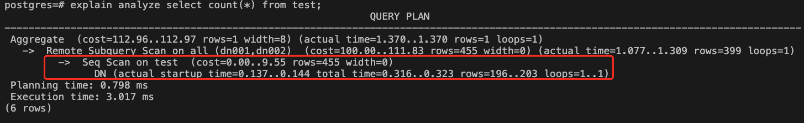

# New features brought by this upgrade:

## 1. Executor/optimizer optimization:
1）Optimize sub-queries into related query. After optimization, statements can be pushed down to the DN computing node for processing, and the performance of some statements can be improved by hundreds of times;

2）FQS query push-down capabilities are enhanced to support more sub-query scenarios to use FQS to push down, and the performance is improved dozens of times;  

## 2. Memory usage optimization:
1）Provides a detailed query view of session memory usage  


2）Automatically release idle connections with excessive memory, reducing the memory usage of all idle connections by about 90%;

3）Support Relcache LRU replacement, which reduces the memory usage in the session by about 55%;  

## 3. Improve the display of explain analyze execution plan：
On CN, you can view the execution information of the operators executed on each DN (previously, the function was limited, and only those on CN could be displayed):  

 previously:

 now:



The slower-running operators can be found through the complete execution information, which provides direction for SQL performance optimization.  

## 4. Added global session view function:
You can get the running status of the processes belonging to all sessions of the entire cluster from CN. The method of use is as follows:

1)  Add the following configuration to postgresql.conf of all nodes(CN and DN):  
                  ```shared_preload_libraries = 'pg_stat_cluster_activity'  ```
                   
2)  create extension pg\_stat\_cluster\_activity;

3)  select session ID:

  
4)  select the detailed information of the distributed active session according to the session ID:


 
In addition to the above, some known bugs have been fixed, and the cluster stability has been improved to a higher level.